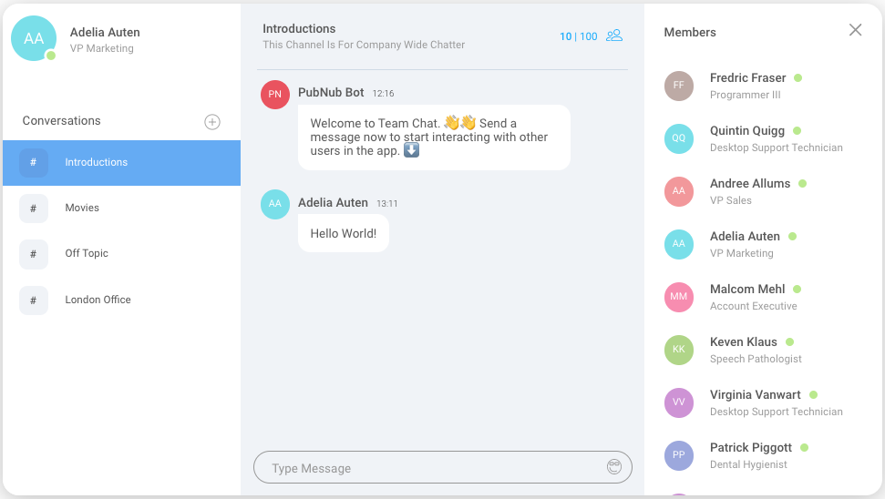

# PubNub Team Chat

[](https://travis-ci.com/pubnub/typescript-ref-app-team-chat)

This repository contains the code for the Team Chat web reference application hosted on the [PubNub Chat Docs Page](https://www.pubnub.com/docs/chat/quickstart#quickstart). You can download the project to run on your local machine, and explore the code to see how we built it.



The application demonstrates how to build a chat application using:

- PubNub
- TypeScript
- React
- Redux

## Requirements

- [Node.js](https://nodejs.org/en/)
- [PubNub Account](#pubnub-account) (*Free*)

## PubNub Account

To run this application you must obtain publish and subscribe keys from your PubNub Account. If you don't already have an account, you can [create one for free](https://dashboard.pubnub.com/).

1. Sign in to your [PubNub Dashboard](https://dashboard.pubnub.com/).

1. Click **Create New App**.

1. Give your app a name, and select **Chat App** as the app type.

1. Click **Create**.

1. Click your new app to open its settings, then click its keyset.

1. Enable the **Objects** feature. **Presence** and **PubNub Functions** should have been enabled when the keyset was created.

1. Select a region to store your user data (e.g. *US East*).

1. Locate the *Publish* and *Subscribe* keys. You'll need these keys to include in this project.

## Running the project

1. Clone the GitHub repository.

    ```bash
    git clone git@github.com:pubnub/typescript-ref-app-team-chat.git
    ```

1. Install the project.

    ```bash
    cd typescript-ref-app-team-chat
    npm install
    ```

1. Run the project in your local environment. If you are running the app for the first time, enter your PubNub keys to begin populating sample data.

    ```bash
    npm start
    ```

    A web browser should automatically open [http://localhost:3000](http://localhost:3000), and you can explore your very own Team Chat app!

## Enable rich message features *(optional)*

### Gif Picker

To enable the gif picker, you need a GIPHY API key.
You can sign up for a (free) developer account and create a key from the [GIPHY developer dashboard](https://developers.giphy.com/dashboard/).

1. Create `.env` at the root of the project to hold your environment variables. This file will no be commited.

1. Copy the API key from the dashboard and add it to `.env`.

    ```dotenv
    GIPHY_API_KEY=your-api-key
    ```

1. The variable needs to be exposed to the React app by adding another line.

    ```dotenv
    REACT_APP_GIPHY_API_KEY=$GIPHY_API_KEY
    ```


1. Restart the dev server for the changes to take effect.

    ```bash
    npm start
    ```


### Image Moderation

In addition to message moderation, AI powered moderation can be enabled to block innapropriate images.

You can sign up for a (free) account and API key from the [Sightengine dashboard](https://dashboard.sightengine.com/).

1. Add the **API User** and **API Secret** to your `.env` file.

    ```dotenv
    FUNCTIONS_SIGHTENGINE_API_SECRET=your-api-secret
    FUNCTIONS_SIGHTENGINE_API_USER=your-api-user
    ```

### /giphy command

The `/giphy ${message}` command shares a gif related to the message.

1. You should have created a GIPHY API key in the [Gif Picker](#gif-picker) section. Exposed it to the function by adding another variable that references it.

    ```dotenv
    FUNCTIONS_GIPHY_API_KEY=$GIPHY_API_KEY
    ```

### Deploy Functions

Link previews, message moderation, and the `/giphy` command are powered by PubNub functions. To enable these features, you'll need to build and deploy the function code in `/server`.

#### Option 1: Automatic Upload

> Note: To manage functions from the CLI, you have to sign in to your PubNub account. This is currently not possible if you created your account with SSO.

1. Use the CLI to build and deploy the functions from source (in `server/src`).

    ```bash
    npm run deploy:functions
    ```

1. Enter your PubNub account email and password (these will **not** be saved).

1. Select your app and keyset using the up/down arrows and return to submit.

#### Option 2: Manual Upload

1. From the PubNub dashboard, select the keyset your are using. Then, open the functions tab (on the left). Enter a module name and description, then click **Create New Module**.

1. Click **Create Function**, give it a name, set the event type to *Before Publish or Fire* and enter `*` for the channel pattern and click **Create**.

1. Use the CLI to build the functions from source (in `server/src`).

    ```bash
    npm run build:functions
    ```

1. After running the build command, a minified and compiled version of the function is available is `server/build/transformPublishedMessages.js`. Copy the contents of the file into the functions editor and click **Save**.

1. Click **Start Module** from the top right to deploy your function.

## Documentation

We've included additional documentation and a detailed tutorial for building a chat app with React, Redux, and PubNub.
You can view it in the `/docs` directory or run the documentation site locally.

### Running the docs website

1. If you haven't already, clone the GitHub repository

    ```bash
    git clone git@github.com:pubnub/typescript-ref-app-team-chat.git
    ```

1. Install the dependencies

    ```bash
    cd typescript-ref-app-team-chat/website
    npm install
    ```

1. Run the docs website locally.

    ```bash
    npm start
    ```
    If the chat app is already running, you may be asked to accept a different port. Your browser should open to [http//localhost:3000](http://localhost:3000) where you can find the tutorial and docs.

## Further Information

Checkout [PubNub Chat Docs](https://www.pubnub.com/docs/chat) page for more information about how to use the React and Redux SDKs to add in-app chat to your applications.

This project was bootstrapped with [Create React App](https://github.com/facebook/create-react-app). Special thanks to Martin Lagrange, Elvis Wolcott, and Mark Erikson.
