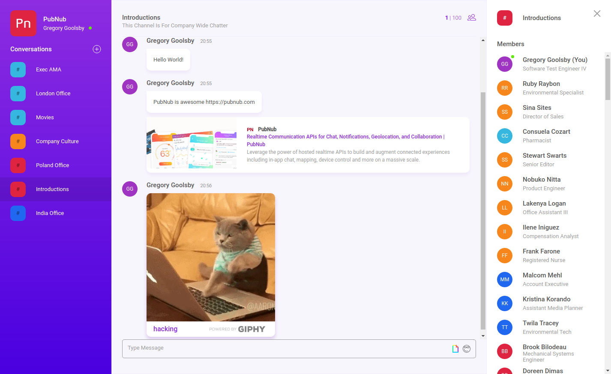

The team chat app demonstrates how to build a feature-rich chat and team collaboration application. Learn how to manage users, join chat rooms, and send messages with PubNub. Get started by downloading the app code from [Github](https://github.com/pubnub/typescript-ref-app-team-chat).  

## Features

The team chat app comes preloaded with the following features:

- **Group messaging** that lets teams communicate in realtime, increasing productivity.
- **User and channel metadata** so you can view channel details, member’s lists, and more without storing data in a separate database.
- **User presence detection** to show who’s online or offline at any moment.
- **Typing indicators** that add responsiveness and improve communication.
- **GIPHY integration** so you can share GIFs and personalize your chats.
- **Rich media** to share emojis and links, improving the end-user experience.
- **Profanity filtering** to replace bad words in messages, keeping chats friendly for everyone.

## SDKs & Frameworks

The app is built using PubNub Chat SDKs and Frameworks for realtime messaging. It uses the following:

- [React](https://www.pubnub.com/docs/chat/react/setup) provides tools to leverage the PubNub JavaScript SDK within a React application.
- [Redux](https://www.pubnub.com/docs/chat/redux/setup) manages state of data components inside an application.
- [Javascript](https://www.pubnub.com/docs/web-javascript/pubnub-javascript-sdk) connects and communicates with the network.

For more information, head over to [PubNub Chat Documentation](https://www.pubnub.com/docs/chat/quickstart) and get started building chat today.